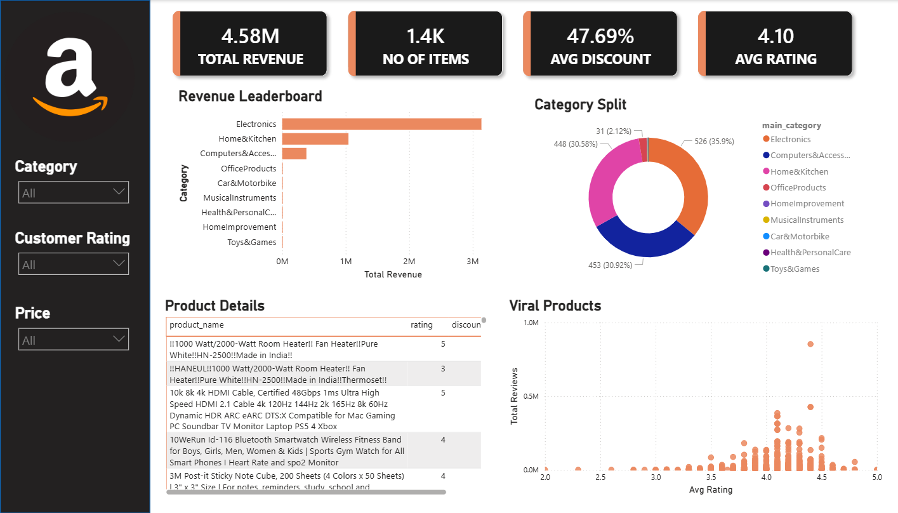
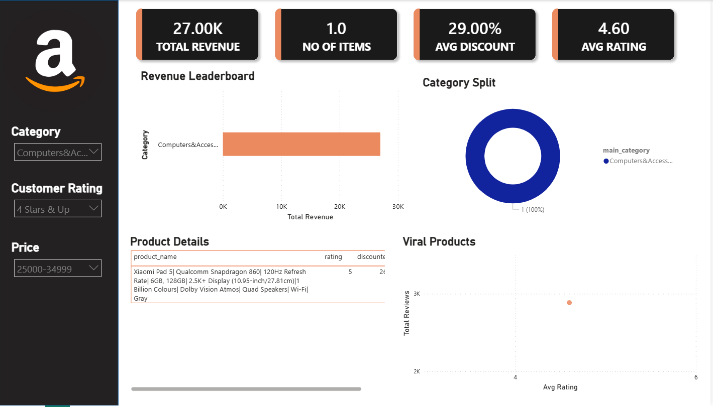
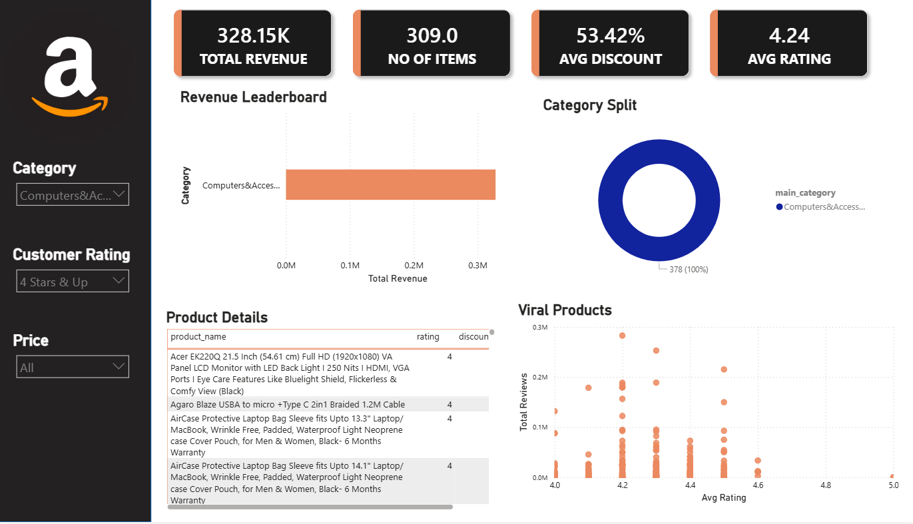

# Amazon Sales Analysis Dashboard

## Project Overview
This project focuses on analyzing Amazon sales data using Python (Pandas) and Power BI to uncover revenue insights, product performance, customer ratings, and category-level trends.

The workflow includes:
- Data Cleaning using Pandas
- Feature Engineering
- Data Visualization using Power BI
- Business Insight Generation

---

## Tools & Technologies Used

- Python
- Pandas
- NumPy
- Power BI
- GitHub

---

## Dataset Information

The dataset contains Amazon product-related information such as:

- Product Name
- Category
- Discounted Price
- Actual Price
- Ratings
- Rating Count
- Product Reviews

---

## Data Cleaning Process (Python)

The dataset was cleaned and transformed using Pandas.

### Cleaning Steps:
- Removed ₹ currency symbols and commas
- Converted price columns into numeric format
- Fixed invalid rating values
- Handled missing data
- Cleaned rating_count column
- Simplified long category names
- Created a cleaned dataset for Power BI

---

## Feature Engineering

Additional transformations performed:
- Created `main_category`
- Standardized numerical columns
- Prepared data for dashboard filtering

---

## Power BI Dashboard Features

### KPI Cards
- Total Revenue
- Number of Items
- Average Discount
- Average Rating

### Interactive Filters
- Category Filter
- Customer Rating Filter
- Price Range Filter

### Visualizations
- Revenue Leaderboard
- Category Split Analysis
- Product Details Table
- Viral Products Scatter Plot

---

## Key Business Insights

- Electronics category generated the highest revenue.
- Some products had very high discounts but average ratings.
- Higher-rated products received better customer engagement.
- Category-wise revenue contribution varies significantly.
- Interactive filters help identify profitable product segments.

---

## Dashboard Preview

### Main Dashboard

### Filtered Dashboard

## Project Structure

Amazon-Sales-Analysis/
│
├── dataset/
├── python/
├── powerbi/
├── dashboard_screenshots/
├── README.md

---

## Conclusion

This project demonstrates:
- Real-world data cleaning
- Exploratory data analysis
- Dashboard development
- Business intelligence reporting
- Interactive data storytelling

---

## Author

Madhumitha S T
